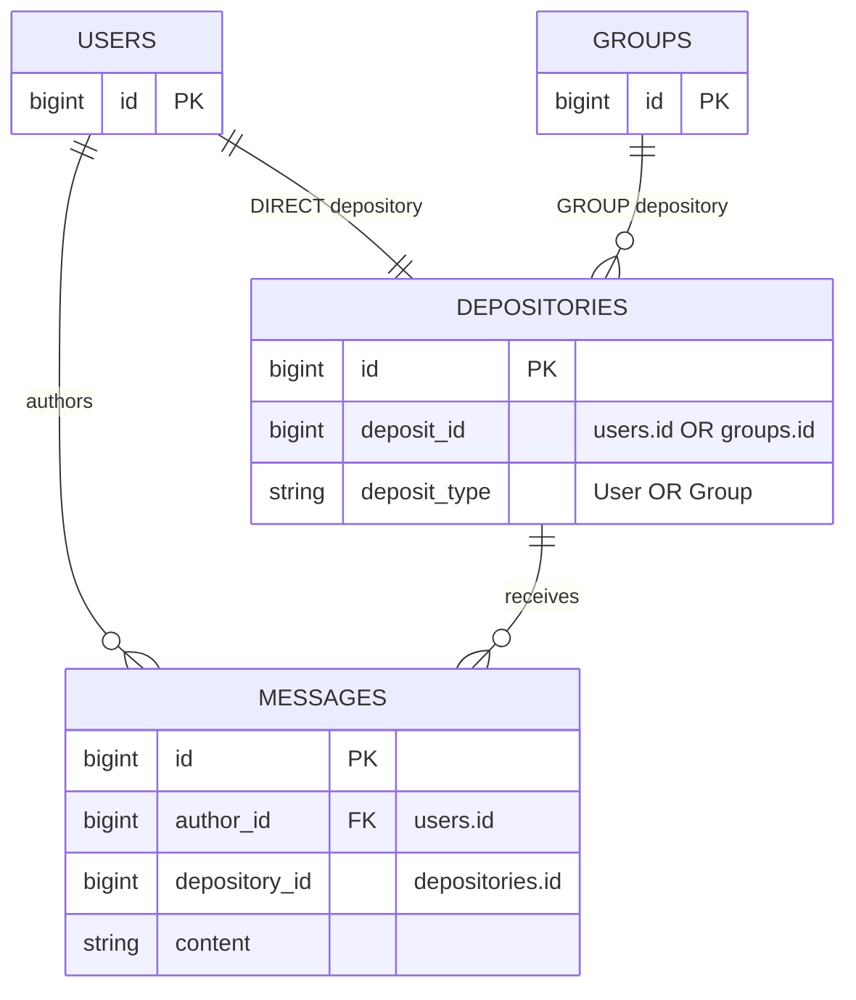
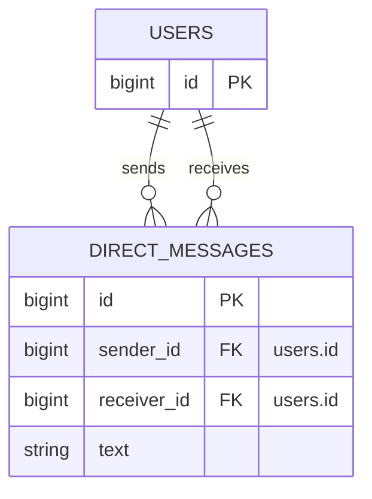
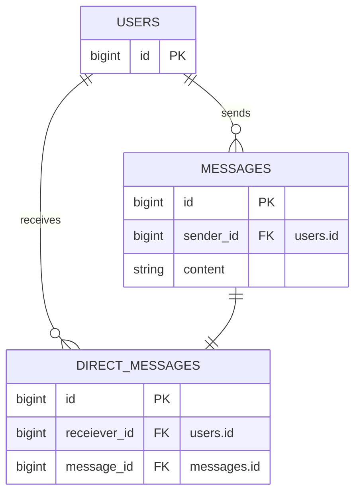
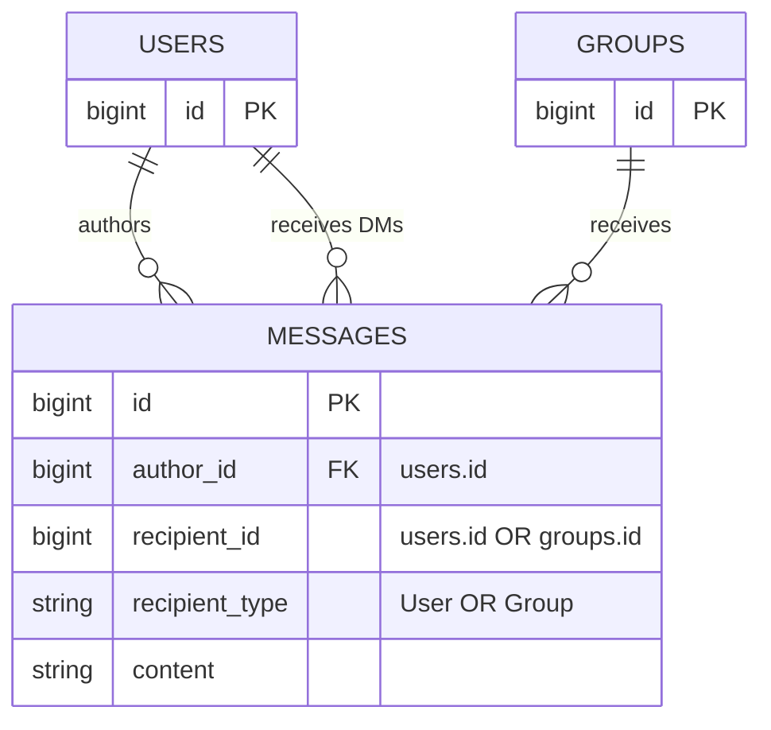
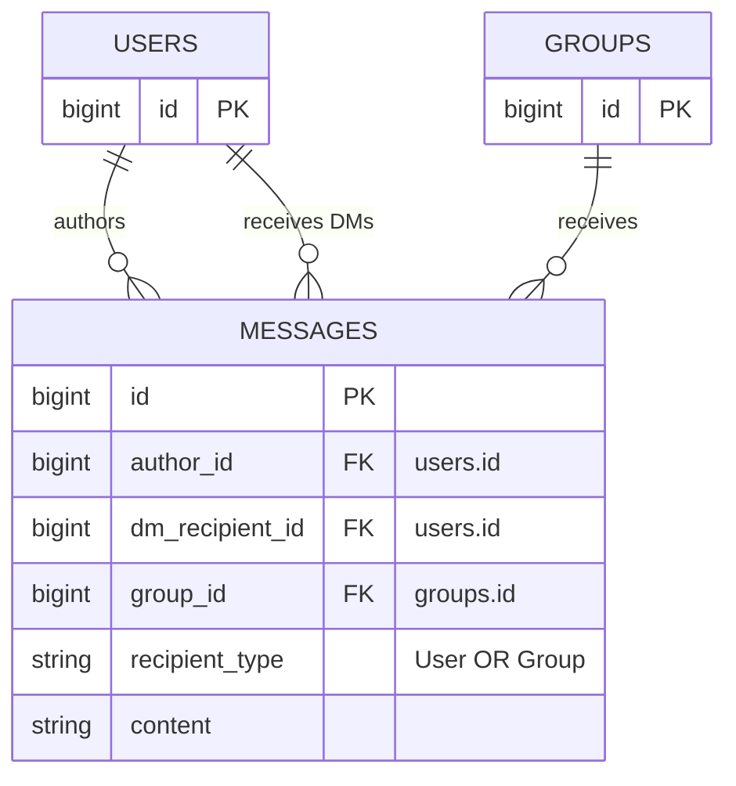
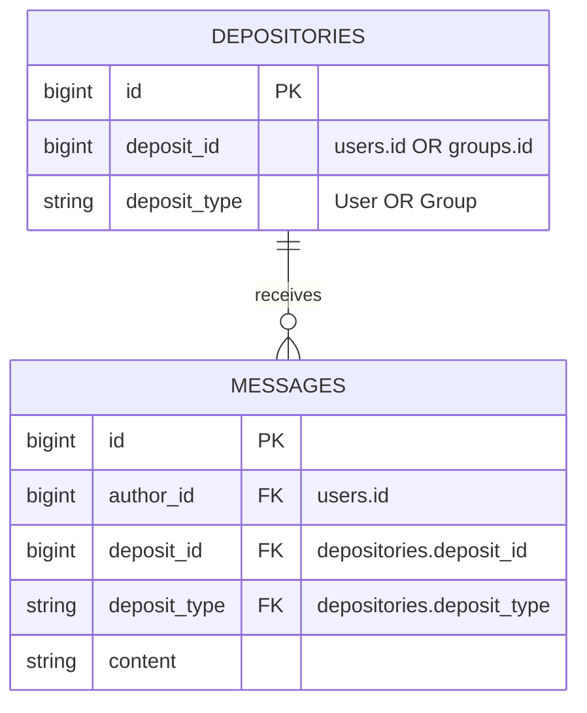

# 20220310190424. Data Models: Messages

Date: 2022-03-10

Service/Subsystem(s): Messages


## Status

Status: Proposed <!-- Proposed | Accepted | Rejected -->


## References

- [Feature: Direct messages][1]
- [Feature: Stream messages][2]
- [Feature: Topic messages][3]
- [Feature: Group messages][4]


## Problem Statement and Context

We need to create data models to map the core text message object(s) and their associations. The
initial goal of the data modeling is to implement the [direct messages][1].


### Decision Drivers

The current road map lists four main features related to messages:

- [Direct messages][1]
- [Stream messages][2]
- [Topic messages][3]
- [Group messages][4]

There is some ambiguity as to if topic and group messages are really all that different. Since all
of these are on the road map we need to keep them in mind when we develop the design. We need to do
that so that we can do our best, given our time constraints, to make design steps that support these
longer term goals. Worst case, we make an informed trade-off that is a lateral step, but we really
don't want to pick a design that will send us backwards.


## Future State / Proposal

### Database Structure



This proposal utilizes a polymorphic associations and an additional entity in an attempt to balance
complexity, future extensibility and data integrity.

We lose data integrity with the polymorphic association (i.e. no foreign keys). We attempt to gain
some of that back by introducing the additional `depositories` entity which we anticipate to have a
much lower cardinality than `messages`.

However, this design builds in flexibility for the planned future expansion into streams, topic
groups and private groups.

### Model Attributes: Messages

All primary keys will use the Rails default of `bigint`. As this is 8 bytes that should provide us
enough runway for some time; even for the core `messages` table.

At a high level a `Message` is composed of:

- An `author` (`User` whom created the message)
- Text content (Max length: TBD - see decision below)
- A `Depository` (Target destination of the message)

  If `Message` was a letter, the `Depository` would where you are sending it.

In terms of columns we have:

- `id`: Standard incrementing primary key (required)
- `author_id`: The foreign key for the ID of the user authoring the message

  We will use the domain term author in the data to help reduce confusion when discussing messages.
  "Author" clearly states which party of the message to which we may be referring.
- `depository_id`: The foreign key for the `Depository`

  Using the letter analogy, this is the address of the letter. And the actual end building is the
  depository itself.
- `content`: The actual message text


## Alternatives and Options Explored

### Model Attributes

The following additional `Message` attributes were considered:

- `authored_at`: Record when a message was "authored" (aka created locally by the client)
- `received_at`: Record when a message was "received" (aka downloaded by the client)
- `deleted_at`: Soft delete a message

  Outstanding questions about `deleted_at`:
  - Can only the author delete?
  - If a DMer is abusive, what recourse is there for the receiver to no longer see the DMs?
  - Does each side need to be able to control their view?

### Naming

For the "author" role the following alternative names are up for consideration (in alphabetical
order and not order of preference):

- composer
- creator
- originator
- sender
- source
- writer

For the "depository" role:

- destination
- receiver
- recipient
- target

For the "message.content" attribute:

- body
- composition
- message
- missive
- quotation
- text

### Database Structure

For the below alternative designs the column names were not finalized. See the _Naming_ section for
detailed discussion around the name aspects.

#### Alternative Design 1



This is a very simple and direct design. However, it is highly tailored to direct messages only.
Given the road map it is likely this design may lead to heavy data migrations to accommodate the
other types of planned messages...OR depending on future choices it could lead to duplication of
core message attributes and validations across multiple tables (e.g. a table for each type of
message).

#### Alternative Design 2



This recognizes the downside for duplication of core message logic across tables. It makes the core
message a first class entity and treats the direct message as an association entity. However, as
with the first alternative design this will either require multiple tables or extensive data
migrations to handle future message types.

#### Alternative Design 3



This intentionally is not flushing out how we will implement the various groups. Instead it is
including some concept of "group" (_handy wavey_) to guide the design. By using polymorphism all
messages are contained to a single table. This should make queries straight forward. However,
polymorphism prevents data integrity through foreign keys. Given the expected high cardinality of
`messages` this could prove to be a long term maintenance nightmare.

#### Alternative Design 4



This is a variation on alternative design 3. Instead of polymorphism this utilizes multiple columns,
one for each of the potential relations. This solves the data integrity issue. However, if it turns
out we have more than just user and group relations (e.g. our assumptions about consolidating the
other messages times doesn't pan out or we get some new type we don't know about) then we'll need to
add a new column per relation. That has scaling issues long term which need to be kept in mind.

_**NOTE:** If we want to use single table inheritance (STI) we can change `recipient_type` to
`type`. We can further improve data integrity by utilizing multiple conditional constraints to
ensure that `dm_recipient_id` and `group_id` are each only set in accordance with the type._

#### Alternative Design Association Variations



This utilizes a multi-column foreign key (compound / composite key) on `messages`:

```sql
FOREIGN KEY (deposit_id, deposit_type) REFERENCES depositories(deposit_id, deposit_type)
```

This type of foreign key doesn't play nicely with Rails without a bit of customization for the
defined associations. That is definitely a bump in ease of use on the code side.

But, this does maintain the data integrity between the tables. And this can provide some
alternatives to avoid the extra SQL joins.

## Decision

**TL;DR; Short summary sentence of the final decision**

<!--
This section resolves questions raised under the Alternatives heading. It is a clear statement of
what the team has settled on as the most appropriate solution to the problem under consideration.

Be sure to include _why_ the decision was made in comparison to the alternatives and options
presented above. As part of the _why_ behind the decision, the reasoning behind accepting any and
all disadvantages or trade-offs of the chosen solution need to be clearly addressed in this section.

Additionally, it is good to include information about _how_ decision drivers impacted the choice. As
well as, what influence the history and long term architecture goals had on this decision.
-->


## Consequences

<!--
This section is intended to be a quick reference for later and thus should matter of factly state
the advantages and disadvantages of the decision. For example, what are the long term impacts? What
things do people need to keep in mind moving forward?

People can reference the Context and Decision sections for the _why_ behind it all.

Finally, make it clear in what the expectations are for other engineers. Do they need to start
making changes in their applications to reflect the decision? Do they need to make a change to their
way of working, or their toolchain? How can they get started? In short, what do teams need to do to
fulfill the requirements of the ADR?

This is also a good time to highlight any sort of follow-up items which are required. For example,
was any part of the decision punted on? Are there glaring unknowns which are being left until a
later time?
-->


[1]: https://github.com/cupakromer/message_swagger/issues/2
[2]: https://github.com/cupakromer/message_swagger/issues/3
[3]: https://github.com/cupakromer/message_swagger/issues/4
[4]: https://github.com/cupakromer/message_swagger/issues/5
