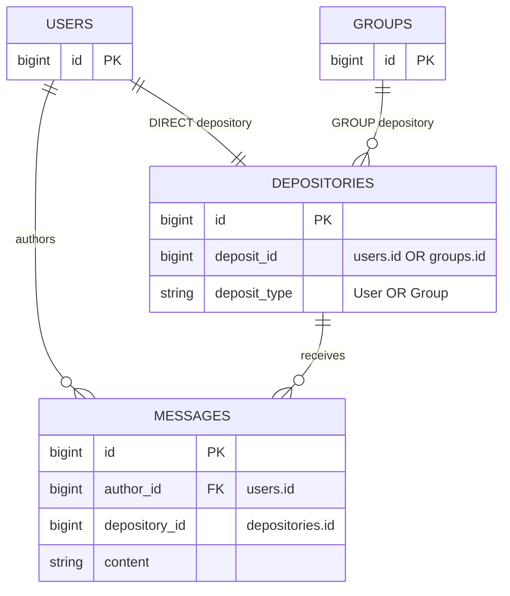
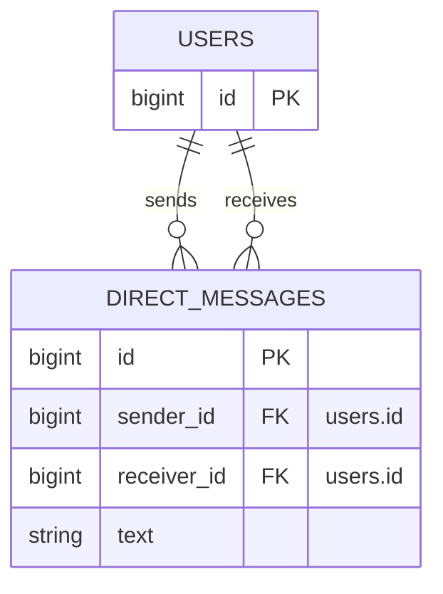
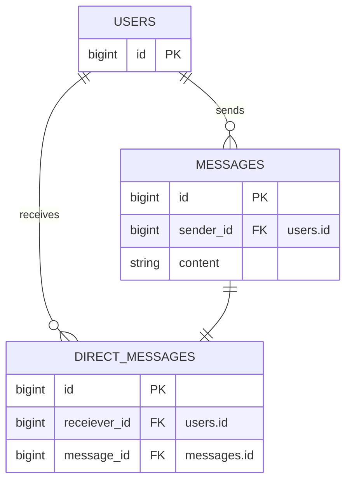
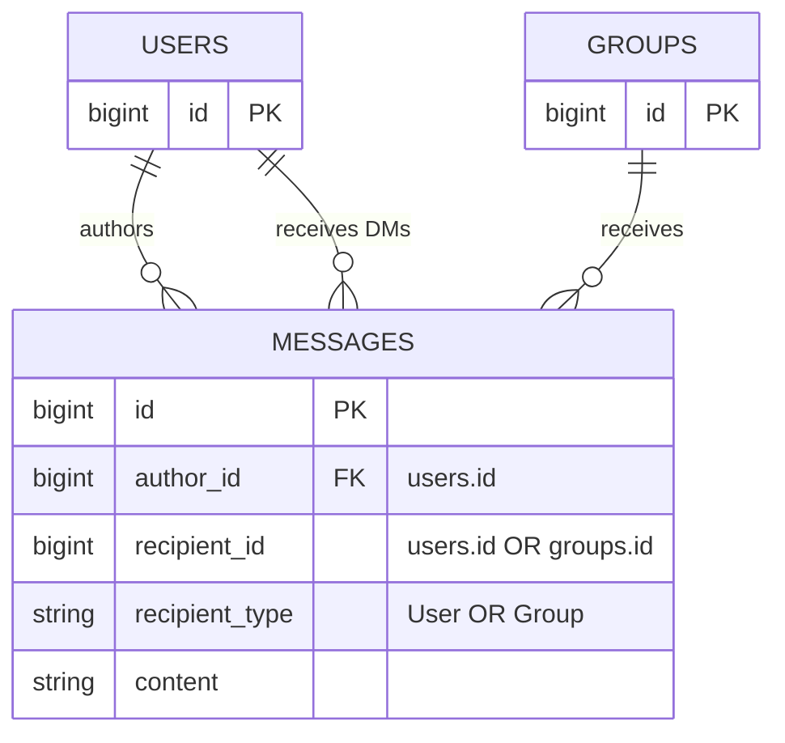
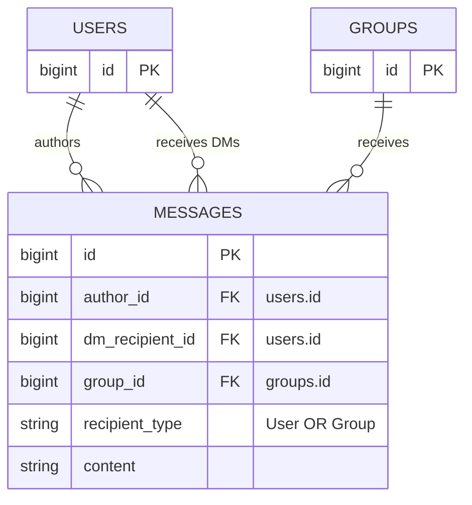
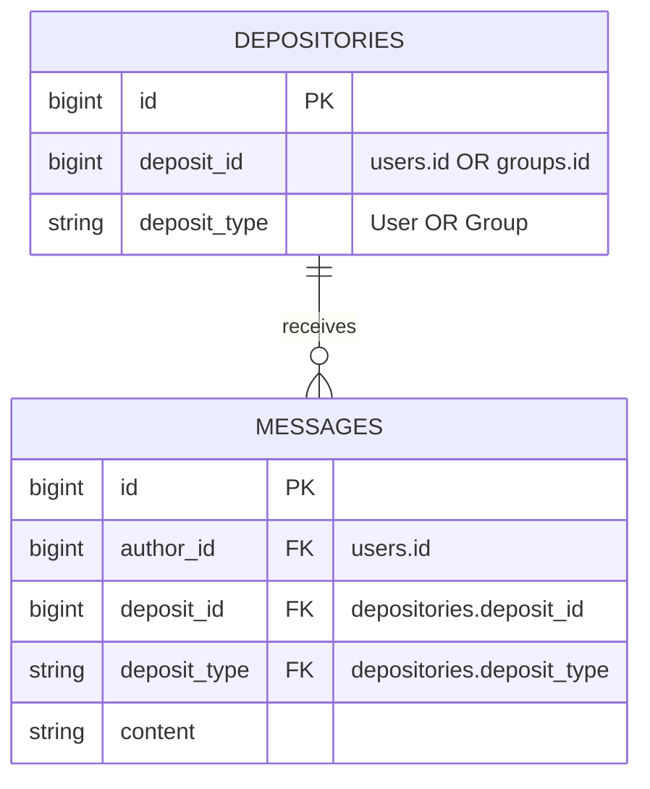
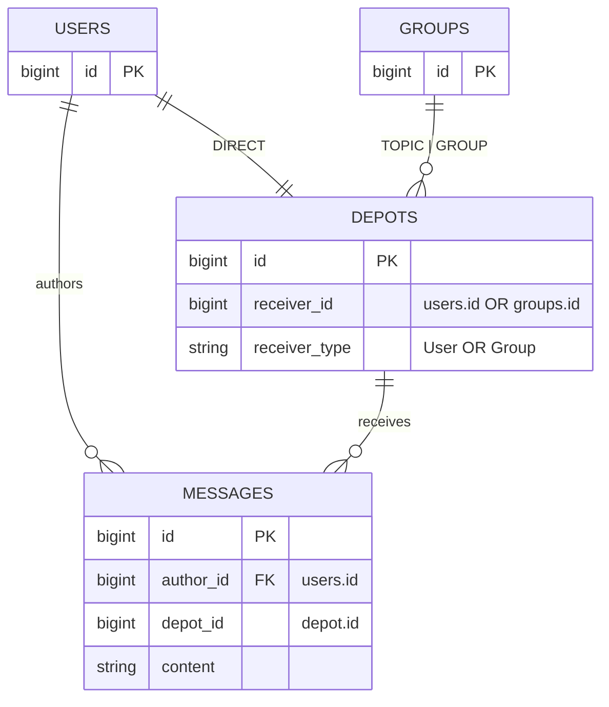

# 20220310190424. Data Models: Messages

Date: 2022-03-10

Service/Subsystem(s): Messages


## Status

Status: Accepted


## References

- [Feature: Direct messages][1]
- [Feature: Stream messages][2]
- [Feature: Topic messages][3]
- [Feature: Group messages][4]
- [PostgreSQL: Data Definition Inheritance][6]
- [PofEAA Catalog: Class Table Inheritance][7]
- [Stack Overflow: "polymorphism" for FOREIGN KEY constraints][8]


## Problem Statement and Context

We need to create data models to map the core text message object(s) and their associations. The
initial goal of the data modeling is to implement the [direct messages][1].


### Decision Drivers

The current road map lists four main features related to messages:

- [Direct messages][1]
- [Stream messages][2]
- [Topic messages][3]
- [Group messages][4]

There is some ambiguity as to if topic and group messages are really all that different. Since all
of these are on the road map we need to keep them in mind when we develop the design. We need to do
that so that we can do our best, given our time constraints, to make design steps that support these
longer term goals. Worst case, we make an informed trade-off that is a lateral step, but we really
don't want to pick a design that will send us backwards.

The potential for a consolidated implementation from the stream, topic and group messages was
discussed with PMs. At this time it seems reasonable to view topic and group messages are
essentially the same thing. The main difference will likely be in the behavior of how users can be
subscribed to those. Please take the following with a measured perspective as a lot of this is still
up in the air. In the discussions, the current thinking is that any user can self-subscribe to
[topic messages][3] but only the existing members of a group can subscribe new people to the
[private group messages][4]; the creator of a private group would automatically become the first
member and such private groups must have at least one member to exist.


## Future State / Proposal

### Database Structure



This proposal utilizes a polymorphic associations and an additional entity in an attempt to balance
complexity, future extensibility and data integrity.

We lose data integrity with the polymorphic association (i.e. no foreign keys; see
[Decision](#decision) below for more details). We attempt to gain some of that back by introducing
the additional `depositories` entity which we anticipate to have a much lower cardinality than
`messages`.

However, this design builds in flexibility for the planned future expansion into streams, topic
groups and private groups.

### Model Attributes: Messages

All primary keys will use the Rails default of `bigint`. As this is 8 bytes that should provide us
enough runway for some time; even for the core `messages` table.

At a high level a `Message` is composed of:

- An `author` (`User` whom created the message)
- Text content (Max length: TBD - see decision below)
- A `Depository` (Target destination of the message)

  If `Message` was a letter, the `Depository` would where you are sending it.

In terms of columns we have:

- `id`: Standard incrementing primary key (required)
- `author_id`: The foreign key for the ID of the user authoring the message

  We will use the domain term author in the data to help reduce confusion when discussing messages.
  "Author" clearly states which party of the message to which we may be referring.
- `depository_id`: The foreign key for the `Depository`

  Using the letter analogy, this is the address of the letter. And the actual end building is the
  depository itself.
- `content`: The actual message text


## Alternatives and Options Explored

### Model Attributes

The following additional `Message` attributes were considered:

- `authored_at`: Record when a message was "authored" (aka created locally by the client)
- `received_at`: Record when a message was "received" (aka downloaded by the client)
- `deleted_at`: Soft delete a message

  Outstanding questions about `deleted_at`:
  - Can only the author delete?
  - If a DMer is abusive, what recourse is there for the receiver to no longer see the DMs?
  - Does each side need to be able to control their view?

### Naming

For the "author" role the following alternative names are up for consideration (in alphabetical
order and not order of preference):

- composer
- creator
- originator
- sender
- source
- writer

For the "depository" role:

- channel (borrowed from Slack)
- depot
- destination
- distribution_list
- dropbox
- inbox
- message_depot
- queue (borrowed from RabbitMQ)
- receiver
- recipient
- target

For the "message.content" attribute:

- body
- composition
- message
- missive
- quotation
- text

### Database Structure

For the below alternative designs the column names were not finalized. See the _Naming_ section for
detailed discussion around the name aspects.

#### Alternative Design 1



This is a very simple and direct design. However, it is highly tailored to direct messages only.
Given the road map it is likely this design may lead to heavy data migrations to accommodate the
other types of planned messages...OR depending on future choices it could lead to duplication of
core message attributes and validations across multiple tables (e.g. a table for each type of
message).

#### Alternative Design 2



This recognizes the downside for duplication of core message logic across tables. It makes the core
message a first class entity and treats the direct message as an association entity. However, as
with the first alternative design this will either require multiple tables or extensive data
migrations to handle future message types.

#### Alternative Design 3



This intentionally is not flushing out how we will implement the various groups. Instead it is
including some concept of "group" (_handy wavey_) to guide the design. By using polymorphism all
messages are contained to a single table. This should make queries straight forward. However,
polymorphism prevents data integrity through foreign keys (see [Decision](#decision)). Given
the expected high cardinality of `messages` this could prove to be a long term maintenance
nightmare.

#### Alternative Design 4



This is a variation on alternative design 3. Instead of polymorphism this utilizes multiple columns,
one for each of the potential relations. This solves the data integrity issue. However, if it turns
out we have more than just user and group relations (e.g. our assumptions about consolidating the
other messages times doesn't pan out or we get some new type we don't know about) then we'll need to
add a new column per relation. That has scaling issues long term which need to be kept in mind.

_**NOTE:** If we want to use single table inheritance (STI) we can change `recipient_type` to
`type`. We can further improve data integrity by utilizing multiple conditional constraints to
ensure that `dm_recipient_id` and `group_id` are each only set in accordance with the type._

#### Alternative Design Association Variations



This utilizes a multi-column foreign key (compound / composite key) on `messages`:

```sql
FOREIGN KEY (deposit_id, deposit_type) REFERENCES depositories(deposit_id, deposit_type)
```

This type of foreign key doesn't play nicely with Rails without a bit of customization for the
defined associations. That is definitely a bump in ease of use on the code side.

But, this does maintain the data integrity between the tables. And this can provide some
alternatives to avoid the extra SQL joins.

#### Additional Message Attributes

During the team discussion (ref [slack][5]), some additional timestamps were broached:

- `sent_at` or `authored_at`: timestamp when a message was successfully sent to the server

  This could allow us differentiate between a client composing the message locally and when the
  server received (i.e. it was "sent").
- `received_at`: timestamp when a client received a message

  Similarly, this would be when a client actually downloads the message. This sort of breaks down
  for group messages as there are multiple end users for those.
- `deleted_at`: support for soft delete

  At scale retaining data people don't want can be costly. This type of soft delete can be useful
  for supporting "Undo" operations for a period of time. However, will direct messages there are two
  sides to who gets to see it. Whom would be able to perform the deletion? Would we need multiple
  timestamps? How would this work with groups?

## Decision

**Proposed schema is accepted with a few modifications.**



The team discussed the changes in [slack][5] and an associated huddle. The team felt the design
looked like a decent compromise as noted above. However, some naming changes were suggested and have
been incorporated in this accepted decision.

The main change is to use the shorter `depot` over `depository`. While `depository` may be more
technically correct per the dictionary definition, it is a lot to say and type. The team felt the
shorter `depot` was a comparable terse alternative. Now that the entity is called `Depot` the
polymorphic names need to be updated so that we don't overload the term. Based on the available
alternatives (per above), the team felt `receiver` was succinct.

In regards to the association reference `author_id`, over say the more conventional Rails `user_id`,
was expression of intent and codifying domain language. The team felt the added complexity this will
incur in the association definition was acceptable for the expression gained. We say "authors write
...", in this case the author is both the composer and the sender. In this case, the team felt the
term "author" clearly expressed both the attribute role and the originator.

And for the message text, we agreed `content` was clear. We rejected several alternatives to avoid
term overloading with the tech stack and domain:

- **body:** too overloaded with HTTP request/response body
- **message:** writing `message.message` looked a bit odd
- **text:** felt too generic and potentially confusing with SMS

The topic of stream messages came up in regards to this design. This ADR isn't intended to solve how
we will implement stream messages, but since our design is influenced by the road map it is
important to note our thoughts on how we thing the design fits with it. We believe this design can
support stream messages in one of two potential ways:

1. `messages.depot_id` may be `NULL` indicating the broadcast intent
2. A special `depots` record is generated using the special ID `0`

   By default PostgreSQL starts all auto-incrementing sequence IDs with 1. So we can treat the `0`
   value as special and assign it to the special "stream depot".

### Database Structure

**Messages Table**

Name                | Type               | Attributes
-----------------   | ------------------ | ---------------------------
**`id`**            | `bigint`           | `not null, primary key`
**`author_id`**     | `bigint`           | `not null, references users(id)`
**`depot_id`**      | `bigint`           | `not null, references depots(id)`
**`content`**       | `string(4000)`     | `not null`
**`created_at`**    | `datetime`         | `not null`
**`updated_at`**    | `datetime`         | `not null`

As noted above, it's possible in the future we will model stream messages by setting `depot_id` to
`NULL`. This design intentionally does not support that. The other alternative we may consider does
have a `depot_id`. For data integrity we know we need `depot_id` for direct messages, so we want to
enforce this from the start. It's always much easier to remove a `NULL` constraint than it is to add
one. When we remove the constraint, all the existing data has a value present, so there's no real
issue. But if we didn't enforce this and we later wanted to add it, it's possible there will be
existing records without a value. Attempting to reconcile that data and decide what value to insert
is not always straight forward. So best to avoid that possibility whenever possible.

We want to keep the message content "short". In discussion with PM we've decided "short" means less
than "a few thousand characters". We are not currently offering markdown formatting as an option so
we've arbitrarily decided 4,000 characters feels like a solid limit. We specifically call our
markdown formatting here as Slack provides it and we'd have to include the format characters as part
of the content; which would mean a potentially higher limit.

**Depots Table**

Name                | Type               | Attributes
-----------------   | ------------------ | ---------------------------
**`id`**            | `bigint`           | `not null, primary key`
**`receiver_id`**   | `bigint`           | `not null`
**`receiver_type`** | `bigint`           | `not null`
**`created_at`**    | `datetime`         | `not null`
**`updated_at`**    | `datetime`         | `not null`

#### Alternative Designs Rejections

The team agreed that _Alternative Design 1_ is too narrowly focuses on just one feature in the road
map and has a high probability of risky data migrations. Thus it was rejected.

With _Alternative Design 2_ the team felt it was a progressive step in clarifying some of the core
"message" structure which is unlikely to change. However, messages don't exist in isolation, so as a
coherent data unit, not having a foreign key to the ultimate destination provides an incomplete
picture; though it does have potential benefits in regards to horizontal scaling / sharding due to
direction of the foreign key association. But it also would mean that for every message we have to
create 2 records (one in `messages` and one in `direct_messages`).

Polymorphic types do not support database level integrity, via foreign keys, without some additional
work (reference [PofEAA Catalog: Class Table Inheritance][7]; there is a nice example of this in a
Stack Overflow [answer on such constraints][8]). Similarly, [PostgreSQL table inheritance][6] treats
the sub-tables as distinct from the parent table and thus each of the parents / child tables
requires a separate foreign key. As noted above _Alternative Design 3_ incurs risk by removing the
foreign key integrity constraint on a high cardinality table. Thus we agreed to reject the design.

_Alternative Design 4_ briefly explore using Rails' single table inheritance to provide strong
foreign key integrity. STI has a lot of detractors due to the tendency for it to balloon tables with
a lot of empty columns. But it has the added benefit of making behavior inheritance and
customizations cleaner in the code.

In summary, the team felt the accepted design was compromise between the trade-offs of polymorphism
and STI. We hope it provides the benefits of both while minimizing, but not eliminating, the
risks/downsides.

For the alternative message attributes, we are passing on them all at the moment. For the local
client timestamps (`authored_at` and `received_at`) there's too many unknowns for the moment. Also,
those feel like things which could be useful for a P2P or LAN/WAN distributed implementation where
they get synced with the online server later. None of this is on the road map so we are not spending
further time considering it today.

As for the soft deletion of the messages. This is an important question, but as noted above, we have
a lot of outstanding questions about behavior. We need to address those first before we implement
that.


## Consequences

Implementation of the associations need to utilizing some configuration to map to the domain
language. Additionally, explicit table joins and unions may be necessary to answer questions such as
"What are all my DMs?".

Due to time constraints the database designs were not benchmarked. As such performance should be
monitored or time taken to utilizing pgbench for confirmation of our choice.

Similarly, handling hiding / deleting messages from only one side of a conversation is not resolved
here. There are legitimate questions around record preservation and preventing abuse (i.e. a victim
shouldn't have to wait for an abuser to delete their message to not see it).


[1]: https://github.com/cupakromer/message_swagger/issues/2
[2]: https://github.com/cupakromer/message_swagger/issues/3
[3]: https://github.com/cupakromer/message_swagger/issues/4
[4]: https://github.com/cupakromer/message_swagger/issues/5
[5]: some-fake-slack-link
[6]: https://www.postgresql.org/docs/14/ddl-inherit.html
[7]: https://www.martinfowler.com/eaaCatalog/classTableInheritance.html
[8]: https://stackoverflow.com/a/28223885
